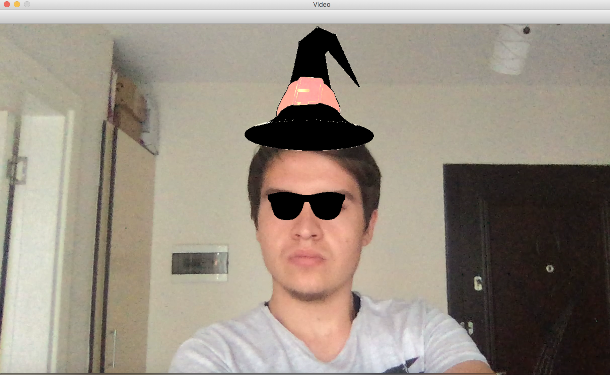

# Opencv examples with python

This repository contains my experiments on image processing.

### Hat and glasses example

By using the camera, you first catch the face, then take your eyes and add the glasses to the face by doing the necessary operations. Finally add a hat photo on top of your head

* Usage

```py
    pyhton hat-and-glasses-filter.py
```

* Response


